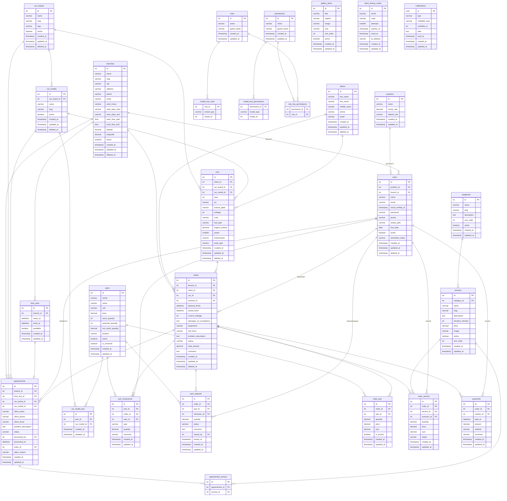

# Схема базы данных — АИС «Автосервис»

ER-диаграмма построена из миграций (`database/migrations`) со всеми полями.
Рендерится автоматически на GitHub и в любом Markdown-просмотрщике с поддержкой Mermaid
(VS Code: расширение *Markdown Preview Mermaid Support*).

> Экспорт в картинку для Word: открой файл в **VS Code** → Preview → ПКМ по диаграмме →
> *Copy Image*, либо вставь код на **mermaid.live** и выгрузи PNG/SVG.

